# SOLARA Energy Solutions
## Company Profile Website using Laravel MVC

This is my Week 3 Mini Project for **ITST 302 – Client-Server Technologies**.

For this project, I created a company profile website for a fictional solar energy company called **SOLARA Energy Solutions**.

I built the website using Laravel, Blade, and Tailwind CSS. The main goal of this activity was to help me understand how Laravel MVC works and how routes, controllers, and Blade views connect to each other.

---

## 1. Project Title

**SOLARA Energy Solutions – Company Profile Website**

SOLARA Energy Solutions is a fictional renewable energy company that provides solar energy solutions for homes and businesses in the Philippines.

The website contains the following main pages:

- Welcome
- Home
- About
- Services
- Contact

The Welcome page is an additional page I created to introduce the company before entering the main website.

---

## 2. Introduction

### What is a Company Profile Website?

A company profile website is a website that introduces a business and gives visitors information about the company.

It normally contains information such as the company's background, services, contact information, mission, vision, and other details that customers may want to know.

### Why Do Businesses Need One?

Businesses need a website because it gives customers an easier way to learn about the company.

Nowadays, people usually search online before contacting a business. Having a company website can help the business look more professional and also makes important information easier to find.

It can also be used to show the company's services and provide customers with a way to contact the business.

### Purpose of This Project

The purpose of this project is to practice using Laravel and understand the basic MVC structure.

Instead of creating normal HTML pages only, I used Laravel routes, a controller, Blade templates, and reusable components.

For my company, I chose solar energy because I wanted to create a website related to renewable energy instead of using a common technology company example.

---

## 3. Objectives

The objectives of this project are:

- Learn the basic structure of Laravel.
- Understand how MVC works.
- Create routes using Laravel.
- Create and use a Laravel controller.
- Use Blade templates to create different pages.
- Create reusable components such as the navbar and footer.
- Create a responsive website using Tailwind CSS.
- Understand how routes, controllers, and views work together.
- Learn how Laravel handles requests from the browser.
- Practice organizing files in a Laravel project.
- Practice using Git and GitHub for version control.

---

## 4. MVC Architecture

### What is MVC?

MVC stands for:

- **Model**
- **View**
- **Controller**

At first, MVC was a little confusing to me because I was more familiar with creating websites using HTML, CSS, and PHP files directly.

After working on this project, I understood that MVC is a way of separating the different parts of an application.

The **Model** is mainly responsible for the data of the application.

The **View** is the part that the user sees in the browser.

The **Controller** handles requests and decides what view or response should be returned.

For this project, I mostly worked with the Controller and Views because the company profile website does not really need a database yet.

### Why Does Laravel Use MVC?

Laravel uses MVC to keep the project organized.

Instead of putting everything inside one file, Laravel separates the different responsibilities of the application.

For example:

- Routes are inside `routes/web.php`
- Controller methods are inside `CompanyController.php`
- Website pages are inside `resources/views`
- Images are stored inside `public/images`

This makes it easier to understand where different parts of the project are located.

### Advantages of MVC

Some advantages of MVC that I noticed while making this project are:

- The project is more organized.
- It is easier to find specific code.
- Different files have different purposes.
- Reusable code can be created.
- It is easier to make changes.
- It can reduce repeated code.
- It makes larger projects easier to manage.

### Laravel Request Flow

This is how I understand the request flow in my Laravel project:

```text
Browser
   |
   v
Route
   |
   v
Controller
   |
   v
Blade View
   |
   v
HTML Response
   |
   v
Browser
```

For example, if a user visits:

```text
/about
```

Laravel first checks the routes inside:

```text
routes/web.php
```

It finds the route for `/about` and calls the `about()` method inside `CompanyController`.

The controller then returns:

```php
return view('pages.about');
```

Laravel loads the Blade view and sends the final HTML page back to the browser.

### Architecture Diagram

The architecture diagram for this project can be found inside the `documentation` folder.

---

## 5. Laravel Routing

### What is Routing?

Routing tells Laravel what should happen when a user visits a certain URL.

The routes for my project are located inside:

```text
routes/web.php
```

An example of a route is:

```php
Route::get('/about', [CompanyController::class, 'about'])
    ->name('about');
```

This means that when a user visits:

```text
/about
```

Laravel calls the `about()` method inside `CompanyController`.

### GET Requests

I used GET requests for the pages that display information to the user.

Examples include:

- Welcome
- Home
- About
- Services
- Contact

### Named Routes

I also used named routes in the project.

For example:

```php
->name('about');
```

Because the route has a name, I can use this inside my Blade files:

```blade
{{ route('about') }}
```

Instead of manually writing:

```html
<a href="/about">
```

I can write:

```blade
<a href="{{ route('about') }}">
```

I found named routes useful because I do not need to manually type the URL every time I create a link.

### POST Route

I also used a POST route for the Contact form.

The GET route displays the Contact page, while the POST route handles the information submitted through the form.

### Route Screenshot

<p align="center">
    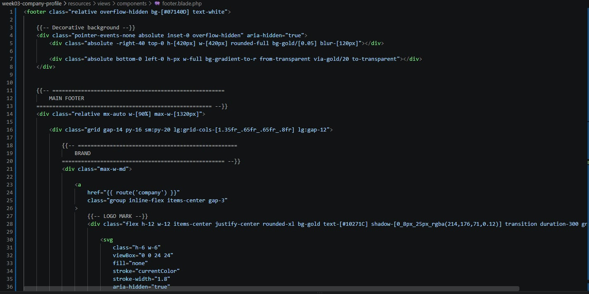
</p>

---

## 6. Controllers

### What is a Controller?

A controller handles requests coming from the routes.

Instead of putting all the page logic inside `web.php`, I created a controller called:

```text
CompanyController.php
```

It is located inside:

```text
app/Http/Controllers/CompanyController.php
```

At first, I thought I could just return all the pages directly from `web.php`, but using a controller made the project more organized.

### Controller Methods

Some of the methods inside my controller are:

```php
public function home(): View
{
    return view('pages.home');
}
```

```php
public function about(): View
{
    return view('pages.about');
}
```

```php
public function services(): View
{
    return view('pages.services');
}
```

```php
public function contact(): View
{
    return view('pages.contact');
}
```

Each method returns the Blade view for a certain page.

I also added a method for the Welcome page because I wanted the website to have a landing page before entering the main website.

### Contact Form

The controller also handles the Contact form.

I used Laravel validation to make sure that the user enters the required information.

Example:

```php
$request->validate([
    'name'    => ['required', 'string', 'max:255'],
    'email'   => ['required', 'email', 'max:255'],
    'message' => ['required', 'string', 'min:10'],
]);
```

This helped me understand that controllers are not only used to display pages. They can also handle information submitted by users.

### Controller Screenshot

<p align="center">
    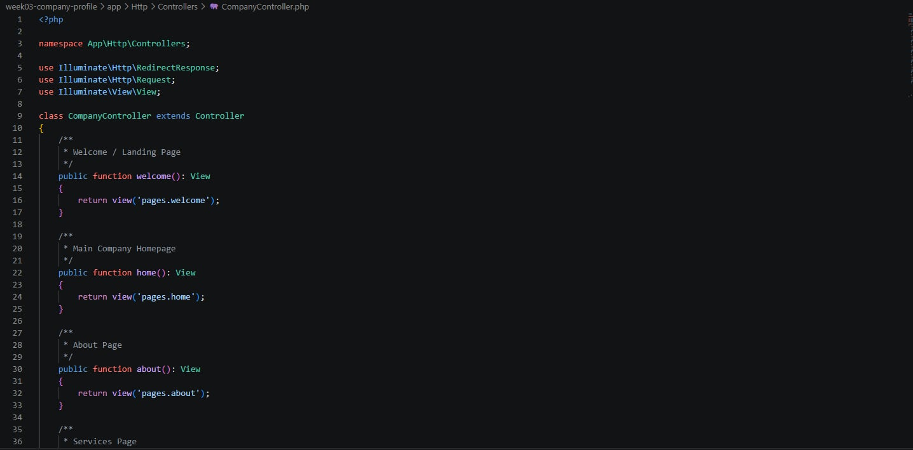
</p>

---

## 7. Blade Templating Engine

### What is Blade?

Blade is the templating engine used by Laravel.

I used Blade to create the different pages of my website.

My Blade files are located inside:

```text
resources/views/
```

### Blade Layout

Instead of creating the same HTML structure for every page, I created one main layout.

My main layout is:

```text
resources/views/layouts/app.blade.php
```

The pages can use this layout by writing:

```blade
@extends('layouts.app')
```

### @section

I use `@section` to define the content that belongs to a page.

Example:

```blade
@section('content')

<section>
    Page content here
</section>

@endsection
```

### @yield

Inside the main layout, I use:

```blade
@yield('content')
```

This tells Laravel where the content from each page should appear.

At first, I did not fully understand how `@section` and `@yield` worked together. After using them on the Home, About, Services, and Contact pages, it became easier to understand.

### Reusable Navbar and Footer

I also created separate Blade files for the navbar and footer.

They are located inside:

```text
resources/views/components/
```

The files are:

```text
navbar.blade.php
footer.blade.php
```

They can be included inside the main layout using:

```blade
@include('components.navbar')

@yield('content')

@include('components.footer')
```

I found this useful because I do not need to copy the same navbar and footer code into every page.

If I want to change something in the navbar, I only need to change `navbar.blade.php`.

### Other Blade Features I Used

I used:

```blade
{{ route('contact') }}
```

to create links using named routes.

I also used:

```blade
{{ asset('images/home-page.png') }}
```

to display images stored inside the `public/images` folder.

For repeated content such as services, I also used:

```blade
@foreach
```

This allowed me to create several service cards without writing the same HTML structure repeatedly.

### Blade Layout Screenshot

<p align="center">
    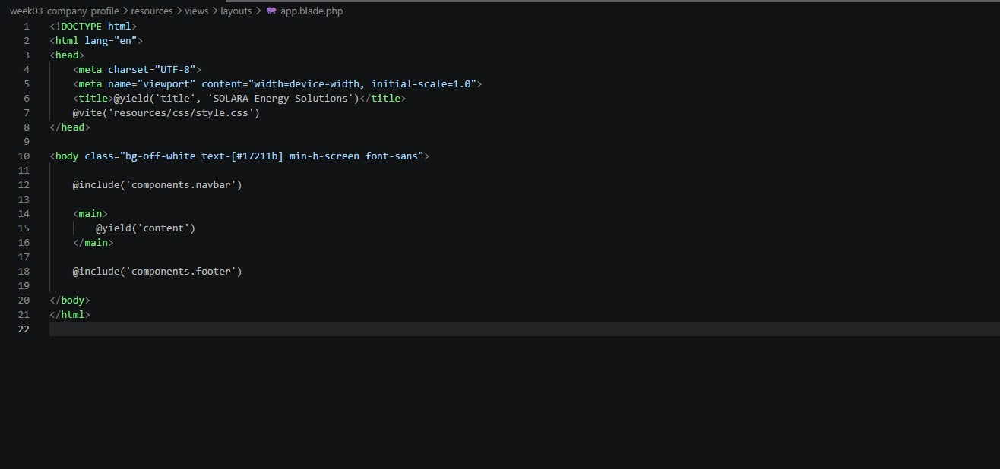
</p>

---

## 8. Laravel Folder Structure

One of the things that confused me when I first opened Laravel was the number of folders.

After working on this project, I started to understand what some of the important folders are used for.

### app/

The `app/` folder contains the main application code.

My controller is located here:

```text
app/Http/Controllers/CompanyController.php
```

### routes/

The `routes/` folder contains the route files.

For this project, I mainly worked with:

```text
routes/web.php
```

### resources/

The `resources/` folder contains things such as Blade views, CSS, and JavaScript.

My project uses:

```text
resources/
├── css/
├── js/
└── views/
    ├── components/
    ├── layouts/
    └── pages/
```

### public/

The `public/` folder contains files that can be accessed by the browser.

I placed the images used by my website inside:

```text
public/images/
```

Some of the images are:

```text
home-page.png
about-page.png
service-page.png
contact-page.png
```

### bootstrap/

From what I understand, the `bootstrap/` folder contains files that Laravel uses when starting the application.

I did not need to make many changes inside this folder for this project.

### config/

The `config/` folder contains Laravel configuration files.

I also did not need to edit most of these files for this activity, but I now understand that they are used for configuring different parts of Laravel.

### Folder Structure Screenshot

<p align="center">
    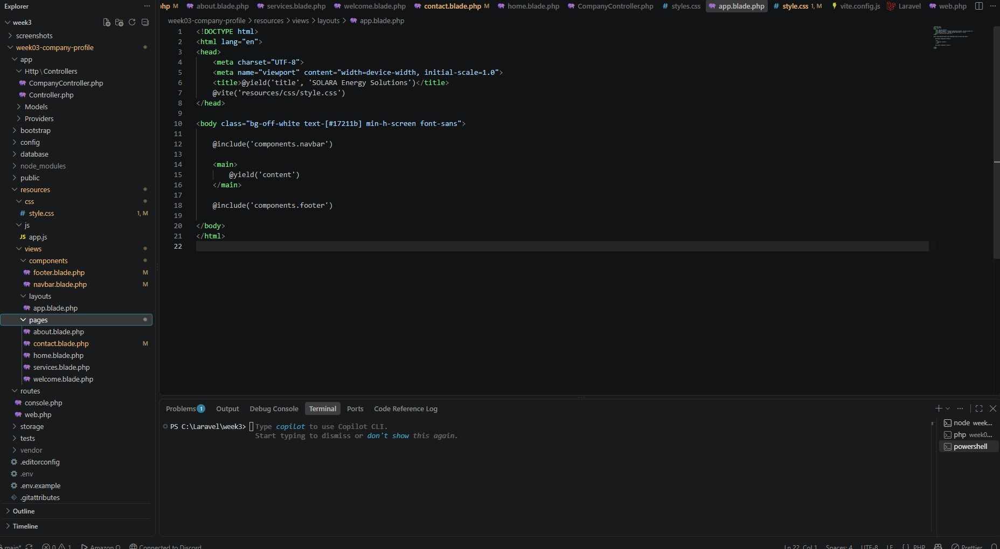
</p>

---

## 9. Screenshots

Below are screenshots of my SOLARA Energy Solutions project.

### Welcome Page

This is the first page that appears when opening the website. I added this as an extra page before entering the main company website.

<p align="center">
    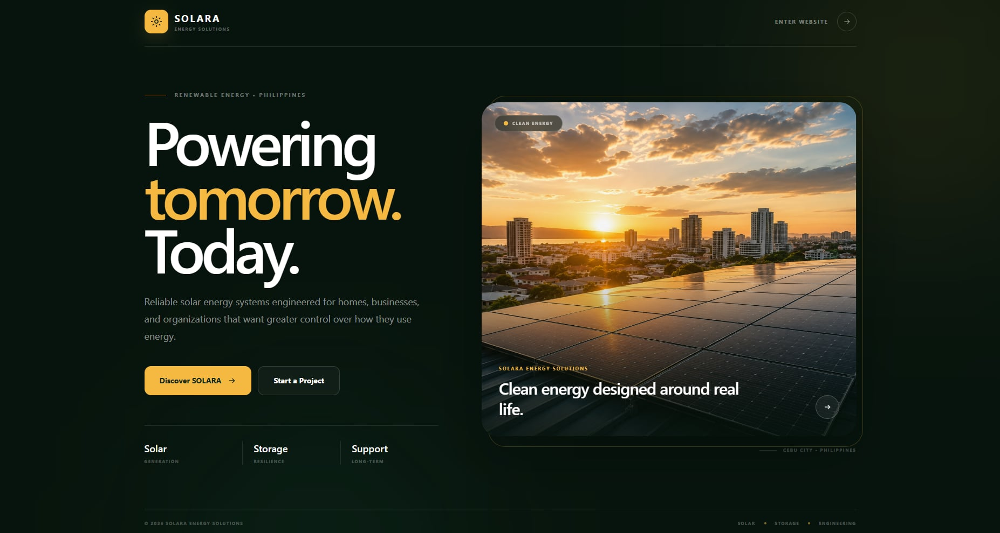
</p>

---

### Home Page

This is the main Home page of SOLARA Energy Solutions. It introduces the company and shows some of the services offered.

<p align="center">
    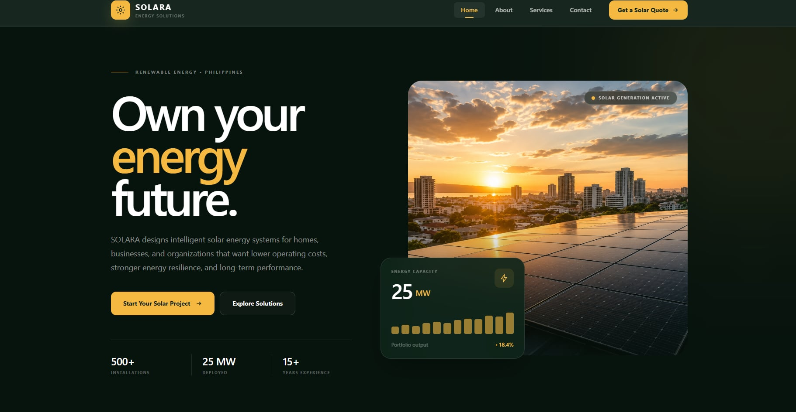
</p>

---

### About Page

The About page contains information about SOLARA Energy Solutions, including information about the company, its mission, vision, and values.

<p align="center">
    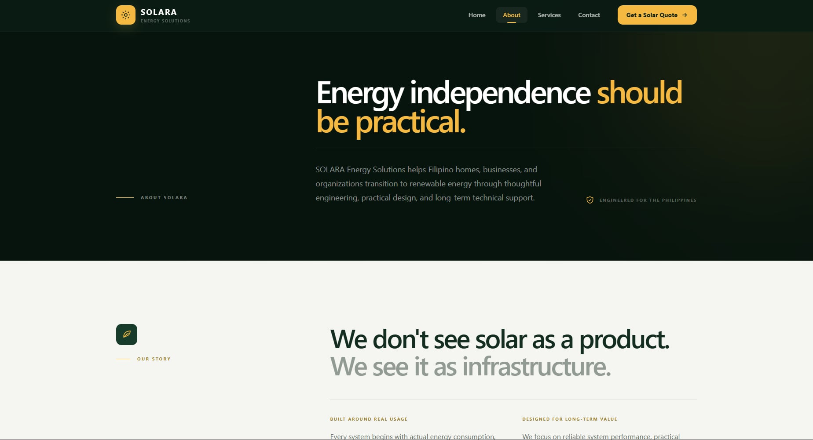
</p>

---

### Services Page

The Services page shows the different solar energy services offered by SOLARA Energy Solutions.

<p align="center">
    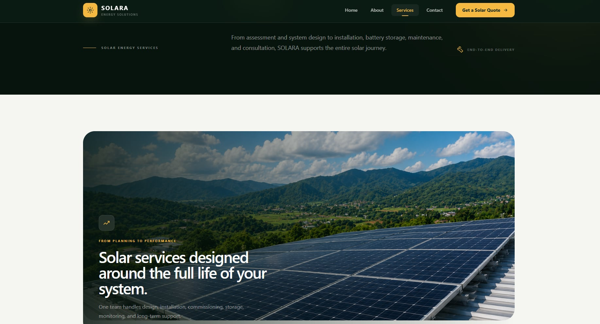
</p>

---

### Contact Page

The Contact page contains the company's contact information and a form where visitors can send an inquiry.

<p align="center">
    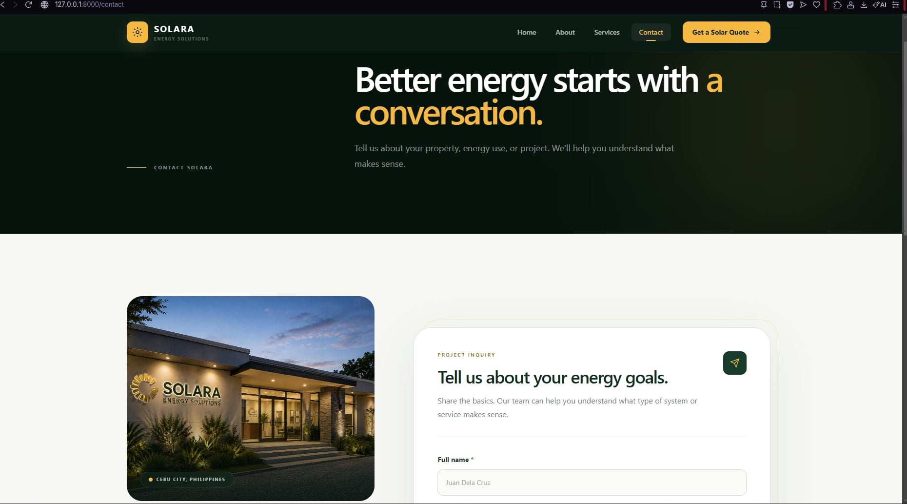
</p>

---

### Navigation Bar

This is the navigation bar used throughout the website. It allows users to go to the Home, About, Services, and Contact pages.

<p align="center">
    
</p>

---

### Footer

This is the footer used throughout the website. It contains company information and contact details.

<p align="center">
    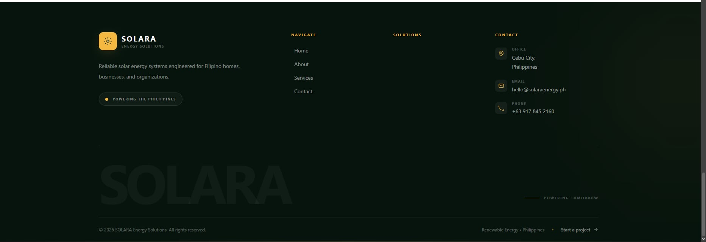
</p>

---

### Laravel Routes

This screenshot shows the routes I created inside `routes/web.php`.

<p align="center">
    
</p>

---

### Company Controller

This screenshot shows my `CompanyController.php`, which handles the different pages of the website.

<p align="center">
    
</p>

---

### Blade Layout

This screenshot shows the main Blade layout used by the pages in the website.

<p align="center">
    
</p>

---

### Laravel Folder Structure

This screenshot shows how the files and folders of my Laravel project are organized.

<p align="center">
    
</p>

---

### VS Code Project

This screenshot shows my SOLARA project while working on it inside Visual Studio Code.

<p align="center">
    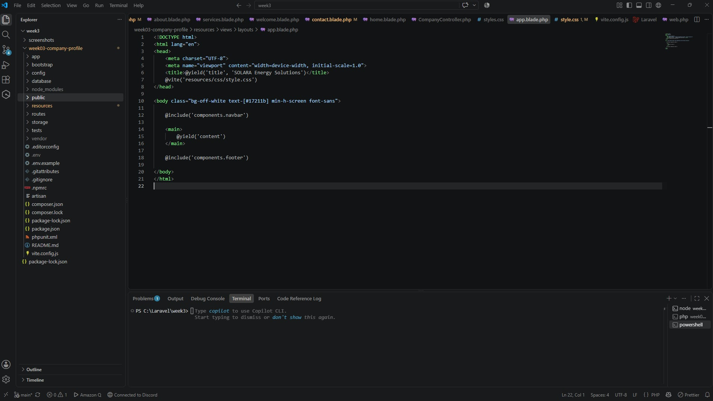
</p>

---

### Browser Output

This screenshot shows the Laravel project running successfully in the browser.

<p align="center">
    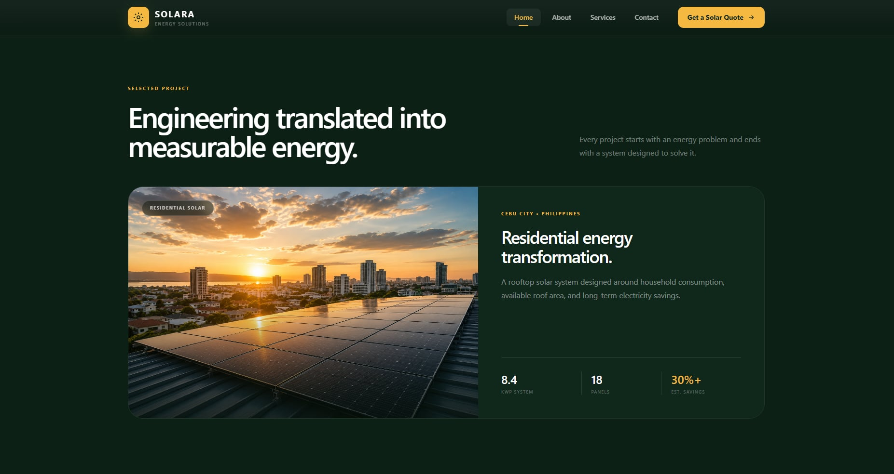
</p>

---

## 10. Problems Encountered

### Problem 1: Tailwind CSS Was Not Working on the Welcome Page

One problem I encountered was when I created the Welcome page.

The page did not look the way I expected. Some of the SVG icons became extremely large and the Tailwind styles were not being applied correctly.

At first, I thought there was something wrong with my SVG code.

After checking the files, I found out that my Welcome page was loading the wrong CSS file.

It was using:

```blade
@vite(['resources/css/app.css', 'resources/js/app.js'])
```

but the CSS file I was actually using for Tailwind was:

```text
resources/css/style.css
```

### Problem 2: Repeating the Navbar and Footer

Another problem I noticed was that every page needed the same navbar and footer.

I could have copied the navbar and footer code into every page, but I realized that this would make the project harder to maintain.

If I wanted to change something later, I would need to change it on every page.

### Problem 3: Making the Website Responsive

Some parts of the website looked good on my desktop but did not look good when the browser became smaller.

The layout, spacing, cards, text sizes, and navigation needed to adjust depending on the size of the screen.

---

## 11. Solutions

### Solution 1: Fixing the CSS File

To fix the Welcome page, I changed:

```blade
@vite(['resources/css/app.css', 'resources/js/app.js'])
```

to:

```blade
@vite(['resources/css/style.css', 'resources/js/app.js'])
```

I also made sure that my Tailwind CSS file was valid.

After making the changes, I ran:

```bash
npm run dev
```

and refreshed the website.

After that, the Tailwind styles started working properly.

### Solution 2: Creating Reusable Blade Files

Instead of copying the navbar and footer into every page, I created separate files for them:

```text
resources/views/components/navbar.blade.php
resources/views/components/footer.blade.php
```

I then included them inside the main layout.

This means that if I want to change the navbar or footer, I only need to edit one file.

### Solution 3: Using Tailwind Responsive Classes

To make the website work better on different screen sizes, I used Tailwind responsive classes such as:

```text
sm:
md:
lg:
```

For example:

```html
grid grid-cols-1 lg:grid-cols-2
```

This means the layout can use one column on smaller screens and two columns when the screen becomes larger.

I also used responsive classes for text sizes, spacing, buttons, and other parts of the website.

---

## 12. Reflection

Before this activity, I knew that Laravel was a PHP framework, but I did not really understand how it worked. I was more familiar with making websites using normal HTML, CSS, and PHP files. Because of this, Laravel looked confusing at first because there were a lot of folders and files that I had not used before.

While doing this project, I started to understand how routes, controllers, and Blade views connect to each other. When I open a URL in the browser, Laravel checks the route first. The route then calls the correct method inside the controller, and the controller returns a Blade view. This helped me understand what happens before a page is shown in the browser.

I also learned why MVC is useful. Instead of putting everything inside one file, Laravel separates different parts of the project. My routes are inside `web.php`, my page methods are inside `CompanyController`, and the design of the pages is inside my Blade files. I think this makes the project easier to understand because I know where to look when I need to change something.

Another thing I learned was how useful reusable components can be. I created a navbar and footer that are shared by the different pages. Before learning Blade, I probably would have copied the same navbar code into every HTML page. Now I understand why that is not a good idea because I would need to update every file if I wanted to change something.

I also learned from the problems I encountered while making the website. One of the problems that confused me the most was when Tailwind CSS was not working on my Welcome page. The design looked broken and the SVG icons became extremely large. I eventually found out that I was loading `app.css` instead of `style.css`. It was a small mistake, but it affected the whole page. This taught me that checking file paths is important when something is not loading correctly.

Making the website responsive was also challenging because some designs looked good on my computer but changed when I made the browser smaller. Using Tailwind responsive classes helped me understand how the same page can have different layouts depending on the screen size.

I can see how MVC would be useful in bigger applications because separating the code would make the project easier to organize when more pages, users, database tables, and features are added. I am still new to Laravel, but after working on this project, I now have a better understanding of how routes, controllers, Blade views, and reusable components work together.

---

## 13. References

Laravel. (n.d.). *Laravel documentation*. https://laravel.com/docs

MDN Web Docs. (n.d.). *HTML: HyperText Markup Language*. Mozilla. https://developer.mozilla.org/en-US/docs/Web/HTML

PHP Documentation Group. (n.d.). *PHP manual*. https://www.php.net/manual/en/

Tailwind Labs. (n.d.). *Tailwind CSS documentation*. https://tailwindcss.com/docs

---

## Technologies Used

The technologies I used for this project are:

- PHP
- Laravel
- Blade
- Tailwind CSS
- HTML
- CSS
- JavaScript
- Vite
- Git
- GitHub

---

## Author

John Carlo R. Benitez

ITST 302 – Client-Server Technologies  
Week 3 – Mini Project 02  
Company Profile Website using Laravel MVC